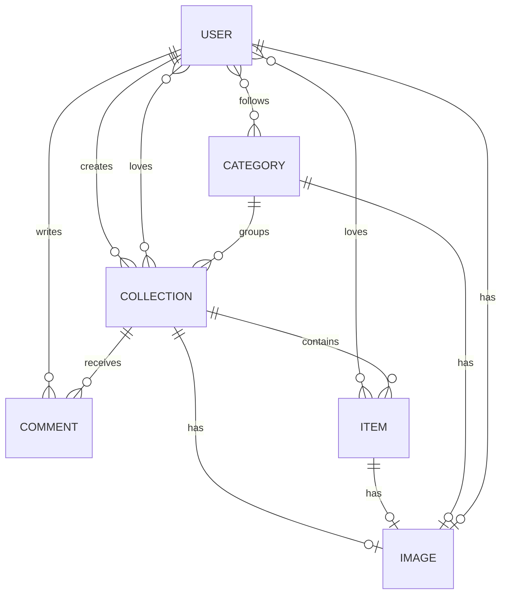

# 🏺 CooLleCT – Plataforma de coleccionismo social


> Aplicación Laravel para crear, compartir y descubrir colecciones temáticas.  
> Usuarios pueden **crear categorías**, **subir colecciones e ítems**, **comentar**, y **dar “me gusta” (LoveIt)**.  
> Es un sistema pensado para comunidades de coleccionistas — numismática, arte, cromos, minerales, NFTs o cualquier ámbito de catálogo.

---

## 🧭 Visión general del negocio

**Aigües BCN Collections** nace como una plataforma social centrada en el **coleccionismo digital**.  
Cada usuario puede:
- Organizar sus objetos en **colecciones personales** agrupadas por **categorías**.
- Mostrar imágenes, descripciones y certificados asociados.
- Interactuar con otros usuarios a través de **comentarios** y **likes**.
- Conectar su cuenta mediante **OAuth (GitHub, Google, etc.)** o registro tradicional.

El objetivo del producto es **fomentar comunidades** donde los usuarios:
1. Exhiben sus colecciones.
2. Intercambian conocimiento o piezas.
3. Descubren tendencias (qué categorías o ítems son más valorados).

> 🎯 **Propuesta de valor:** Un “Instagram de coleccionistas” — donde cada colección tiene metadatos, autenticación de autoría, y trazabilidad mediante certificados e imágenes.

---

## ✨ Principales funcionalidades

### 👤 Usuarios
- Registro por email o OAuth (GitHub, Google…).
- Gestión de perfil (nombre, email, imagen de usuario).
- Sistema JWT para autenticación segura vía API.
- Envío automático de emails de verificación y recuperación de contraseña.

### 🗂️ Categorías
- Creación, edición y eliminación de categorías (por administradores o usuarios).
- Imagen representativa (`icon`) para cada categoría.
- Relación **N:M** con usuarios → cada usuario puede seguir/interesarse por varias categorías.

### 🏺 Colecciones
- Pertenecen a una **categoría** y a un **usuario autor**.
- Cada colección tiene:
  - Nombre, descripción e imagen principal.
  - Listado de ítems (objetos individuales).
  - Comentarios asociados.
  - Contador de “likes” (LoveIt).
- Se pueden consultar todas las colecciones por categoría o por usuario.
- Los usuarios pueden marcar colecciones favoritas (función “Love”).

### 📦 Ítems
- Elementos individuales dentro de una colección.
- Cada ítem puede tener:
  - Imagen individual.
  - Descripción breve.
  - Likes propios (LoveIt).
- Permite construir catálogos ricos y visuales.

### 💬 Comentarios
- Cualquier usuario autenticado puede comentar en colecciones.
- Los autores pueden editar o eliminar sus comentarios.
- Cada comentario incluye:
  - Contenido textual.
  - Nombre del autor.
  - Indicador `isAuthor` (permite al frontend marcar comentarios propios).

### ❤️ LoveIt (Likes)
- Sistema de “me gusta” en colecciones e ítems.
- Relación **N:M** entre usuarios y colecciones/ítems.
- Muestra número total de likes y si el usuario actual ya la marcó como favorita.

### 🖼️ Imágenes
- Gestión centralizada de imágenes de usuarios, categorías, colecciones, ítems y certificados.
- Permite subir:
  - Archivos tradicionales (`multipart/form-data`).
  - Imágenes en **base64** (para API mobile).
- Guardadas en `storage/app/public` y servidas vía `storage:link`.

### 🧾 Certificados (WIP)
- Asociados a colecciones o ítems para demostrar autenticidad.
- Gestión similar a imágenes (subida, almacenamiento y consulta).

---

## ⚙️ Aspectos técnicos clave

| Capa | Descripción |
|------|--------------|
| **Framework** | Laravel 8+ con Eloquent ORM |
| **Autenticación** | JWT (Tymon) + OAuth (Socialite) |
| **Base de datos** | MySQL o PostgreSQL |
| **Subida de archivos** | `Storage` (disk `public`) |
| **Notificaciones** | Email de verificación y reset password |
| **Busqueda** | Integración con `spatie/laravel-searchable` |
| **Testing** | PHPUnit (pendiente ampliar cobertura) |
| **Front-end** | Blade (básico) o API-first para SPA/mobile |

---

## 🧱 Modelo de datos simplificado



---

## 🚀 API – resumen funcional

| Endpoint | Acción | Descripción |
|-----------|--------|--------------|
| `POST /register` | Crear usuario | Devuelve JWT |
| `POST /login` | Iniciar sesión | Retorna token JWT |
| `GET /api/categories` | Listar categorías | Incluye imagen |
| `POST /api/categories` | Crear categoría | Solo autenticado |
| `GET /api/categories/{id}/collections` | Colecciones por categoría | Pública |
| `POST /api/collections` | Crear colección | Auth, con imagen base64 |
| `GET /api/collections/{id}` | Ver colección | Detalles + ítems + comentarios |
| `POST /api/comments` | Crear comentario | Auth |
| `POST /api/collections/{id}/like` | Like colección | Auth |
| `DELETE /api/collections/{id}/like` | Unlike colección | Auth |
| `GET /api/my/collections` | Colecciones propias | Auth |
| `GET /api/my/favorites` | Favoritos | Auth |

---

## 🧩 Casos de uso clave

### 1️⃣ Usuario crea una colección
1. Autenticarse (JWT u OAuth).
2. Escoger categoría existente o crear una nueva.
3. Subir imagen base64 opcional.
4. Crear colección (`POST /api/collections`).
5. Añadir ítems (`POST /api/items`).

### 2️⃣ Usuario explora categorías
- Consulta `/api/categories`.
- Cada categoría lista colecciones destacadas.
- Puede seguir categorías de interés (`attachCategoryUser`).

### 3️⃣ Interacción social
- Comenta en una colección.
- Da “Love” (like) a colecciones e ítems.
- Consulta su propio perfil y sus colecciones favoritas.

---

## 🧠 Lógica de negocio destacada

- **Autoría:** solo el usuario que creó una colección o comentario puede modificarla o eliminarla.  
- **Visibilidad:** colecciones visibles por categoría o usuario.  
- **Gamificación futura:** métricas de popularidad, ranking de coleccionistas, badges por participación.  
- **Extensibilidad:** el modelo admite certificados digitales, etiquetas y colecciones colaborativas.

---

## 🧰 Instalación técnica

```bash
git clone <repo>
cd <repo>
cp .env.example .env
composer install
php artisan key:generate
php artisan migrate
php artisan storage:link
php artisan serve
```

> Visita `http://127.0.0.1:8000`


---

## 📈 Futuras mejoras

- [ ] Panel admin para moderar colecciones y usuarios.  
- [ ] Sistema de etiquetas / búsqueda avanzada.  
- [ ] Exportación a PDF o CSV.  
- [ ] Notificaciones in-app y email de actividad.  
- [ ] API pública con claves personales.  
- [ ] Integración IA: detección automática de tipo de objeto por imagen.
